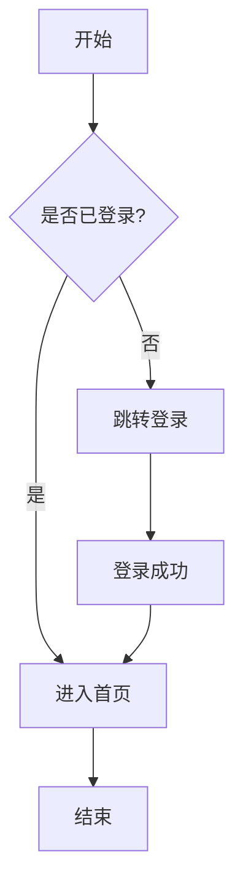
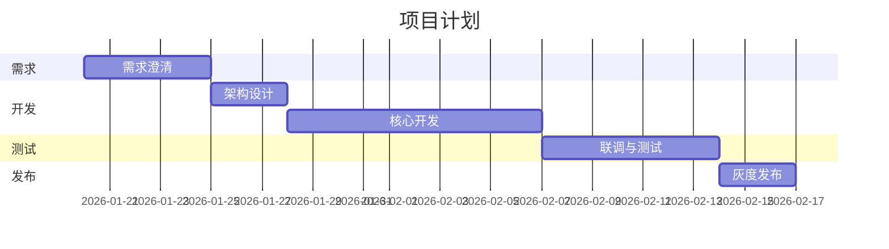
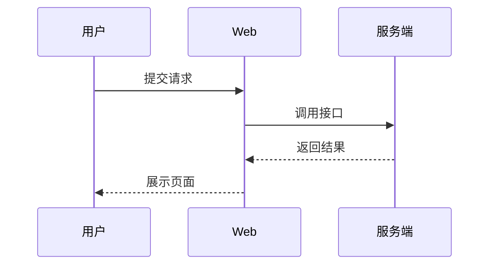

用 AI 画「流程图 / 甘特图 / 时序图 / 架构图」最实用的办法其实就三类：**自然语言 → 图**、**结构化文本（DSL）→ 图**、**表格数据 → 图**。
下面给你一套直接能用的做法和模板（你在 draw.io / WPS / 飞书 / Notion / VS Code 都能落地）。

---

## 1）最通用：用 Mermaid / PlantUML 这类“文本画图”

你把需求写成结构化文字，AI 负责生成 Mermaid/PlantUML，然后你粘贴到支持的工具里渲染。

### A. 流程图（Mermaid）

**你对 AI 的输入模板：**

- 角色/系统：A、B、C（谁参与）

- 目标：要完成什么

- 步骤：按顺序列出

- 分支条件：什么条件走哪条路

- 异常/回滚：失败怎么处理

**让 AI 输出 Mermaid flowchart：**

### B. 甘特图（Mermaid）

适合做中小型计划、里程碑、依赖关系概览。

### C. 时序图（Mermaid）

> 你已经在用 draw.io：draw.io 支持 Mermaid（你之前也在问 Mermaid 怎么看语句），所以这条路线和你最贴。

---

## 2）AI 直接生成“可渲染”的图：适合快速出图

你直接跟 AI 说：**“输出 Mermaid/PlantUML/Graphviz DOT，并保证能在 X 工具运行”**。

常用组合：

- **draw.io**：Mermaid、PlantUML（插件/导入）、也能导入 SVG

- **Markdown 编辑器**：Mermaid 最方便（MarkText、Obsidian、Typora、GitLab/GitHub 等）

- **VS Code**：Mermaid 插件 / PlantUML 插件（配 Java）

- **WPS/Word**：通常走“先导出图片（SVG/PNG）再插入”

---

## 3）从表格/Excel 生成甘特图：适合项目管理

如果你已经有任务清单（任务名、开始日期、结束日期、负责人、进度），AI 可以做两件事：

1. 把清单转换成 Mermaid gantt / Project 格式

2. 生成 Excel/WPS 里可用的甘特图结构（例如：日期列 + 条形填充规则）

**你给 AI 一张表即可：**

- 任务 | 开始 | 结束 | 负责人 | 依赖 | 进度%

AI 输出：

- Mermaid gantt（用于文档）

- 或者“Excel 公式 + 条件格式方案”（用于真正的甘特图表）

---

## 4）给你一套“万能提示词”（你直接复制用）

### 流程图提示词

把【】里的内容替换成你的业务：

> 请根据下面描述生成 **Mermaid flowchart**。  
> 要求：  
> 1）节点用中文短句；2）分支条件写在连线上；3）包含异常路径；4）不要输出解释文字，只输出 Mermaid 代码块。  
> 描述：  
> 【这里写流程：触发条件、步骤、分支条件、失败处理、结束状态】

### 甘特图提示词

> 请把下面任务清单生成 **Mermaid gantt**。  
> 要求：dateFormat 用 YYYY-MM-DD；有 section；依赖用 after；里程碑用 milestone；只输出 Mermaid 代码块。  
> 任务清单：  
> 【任务、开始、工期/结束、依赖、里程碑信息】

### 时序图提示词

> 请根据下面交互生成 **Mermaid sequenceDiagram**。  
> 要求：参与者不超过 6 个；关键接口写明；包含失败返回。只输出 Mermaid 代码块。  
> 交互描述：  
> 【谁调用谁、顺序、返回、异常】

---

## 5）工具怎么选（按你的使用场景）

- **写设计文档/说明书**：Mermaid（最轻量、可版本管理）

- **需要特别漂亮、可拖拽**：draw.io（但最好保留 Mermaid 源码，方便维护）

- **项目管理**：Excel/WPS 甘特图（数据驱动、可更新）

- **工程化/自动生成**（你是开发工程师，这个很适合你）：用脚本让 AI 生成 Mermaid → CI 产出 SVG/PNG → 自动塞进文档

---

## 你如果告诉我两样东西，我可以直接给你成品

1）你要画的类型：流程图 / 甘特图 / 时序图 / 架构图  
2）你的一段流程/任务清单（随便用自然语言写）

我就按你常用的 draw.io / WPS 目标格式，直接给你可粘贴运行的 Mermaid（必要时也给 PlantUML 版本）。
